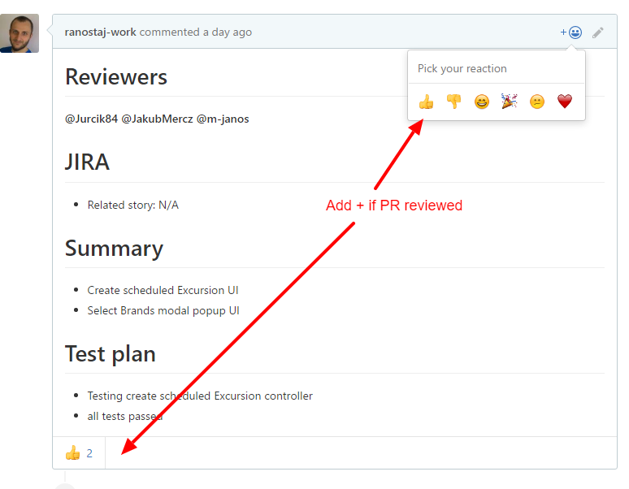
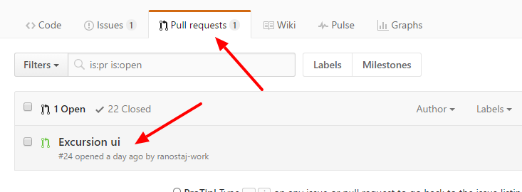
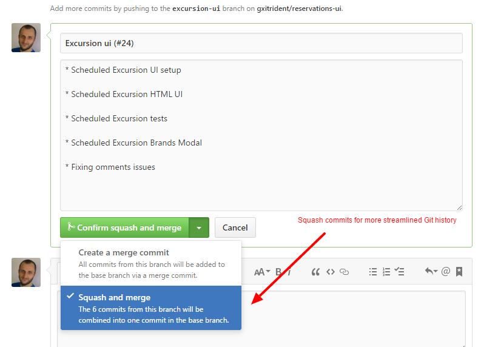

# Collaborating on a repository

### 1. Create your local branch

Create you own local branch from **origin/dev**

Remember to **always pull origin/dev** before you make any local branch

> git checkout -b PREFIX/MY-BRANCH-NAME-JIRA-TASK origin/dev

### Branch name scheme
***PREFIX/MY-BRANCH-NAME-JIRA-TASK***:

* PREFIX
    * **feature** - New feature implementation
    * **fix** - Fixing some errors/issues
    * **refactor** - Refactoring code (technical debt, improvments, etc. )
* MY-BRANCH-NAME
    * Branch name should be short and self explanatory eg. `reservation-ui, reservation-edit, enable-active-flag` etc.
* JIRA-TASK
    * Task or Story number in JIRA eg. `NEPT-323`
    * If branch is not related to any JIRA task then just omit JIRA-TASK part

### 2. Commit your changes
Once you have finished work on your local branch you are ready to commit your changes:
> git add .

> git commit -m "Commit message"

.. later on ...

> git add .

> git commit -m "Commit message 2"


*You can have multiple commits in your local branch*

### 3. Merge with dev branch
Now you should be able to pull and merge your with **dev** branch:

> git checkout dev
> git pull origin dev
> git checkout MY_LOCAL_BRANCH
> git merge dev

### 4. Push to repository 
After your local branch is up to date with origin/dev you can proceed to push your branch:

> git push origin PREFIX/MY-BRANCH-NAME-JIRA-TASK

After you have successfully pushed your new branch into repository go ahead and create **Pull request**

# Pull Requests 

## Creating a Pull request (PR)

Create a pull request to propose and collaborate on changes to a repository. 

Pull requests can only be opened if there are differences between your branch and the upstream branch. 

1. On GitHub, navigate to the main page of the repository.
2. In the "Branch" menu, choose the branch that contains your commits.
3. To the right of the Branch menu, click New pull request.
4. The Compare page will automatically select the base and compare branches; to change these, click Edit.
5. On the Compare page, click Create pull request.
6. Type a title and [comment](#comment) for your pull request.
7. Click Create pull request.


## Comment

This is comment PR template telling reviewers in detail what the PR is about:

```
# Reviewers 
* @reviewer_name, ...

# JIRA
* Related story:STORY-XXX  or N/A (if JIRA is not applicabe)

# Summary 
* Explain in details what have you done 
* Explain new/updated functionality


# Test plan
* Write down what have you tested eg. (testing MyMethod in MyController)
* Write commands to perform test run eg. (gulp karmatest)
* Additional tests info...

```

# Code review process

### 1. Checkout remote branch  

> git checkout -b BRANCH_TO_REVIEW origin/BRANCH_TO_REVIEW

### 2. Steps to review code
* Check for any errors that may popup eg. (check browser console, visual check....)
* Check all changed/added files against **eslint** 
* Check changed/added files against **Code Standards**
* Check described functionality from PR comment
* Run all tests as described in PR comment

### 3. Approve PR

If everything is ok, **add +1** to PR like so:



# Merging a Pull request 

You can merge PR **ONLY** if you've got **2+** from your reviewers:


Merge a pull request into the upstream branch when work is completed. Anyone with push access to the repository can complete the merge. 

If you decide you don't want the changes in your branch to be merged to the upstream branch, you can also close the pull request without merging.

## Merging a pull request using the GitHub web interface

If the merge will not have any conflicts, you can merge the pull request online.

1. Under your repository name, click  **Pull requests**.
2. In the "Pull Requests" list, click the pull request you'd like to merge.

3. Click Merge pull request or if you have merge squashing enabled, click Confirm squash and merge.

4. Type a commit message, or accept the default message.
5. Under the commit message box, click Confirm merge.
6. Optionally, delete the branch. This keeps the list of branches in your repository tidy.

Pull requests are merged using the --no-ff option
